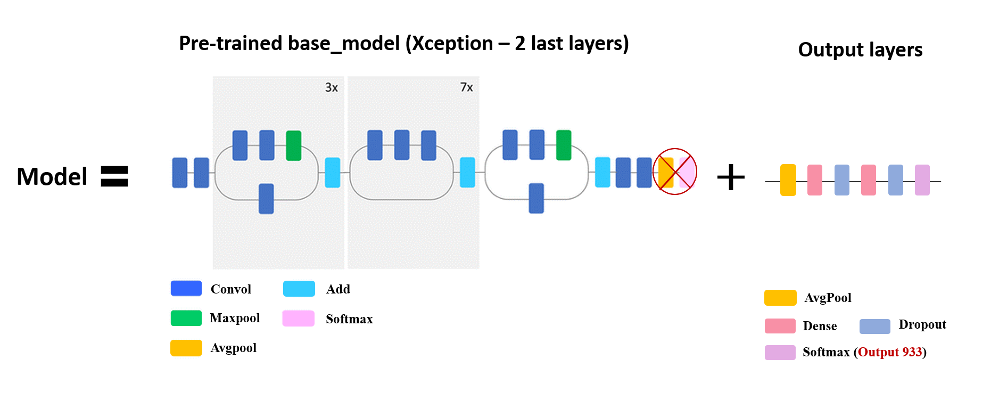
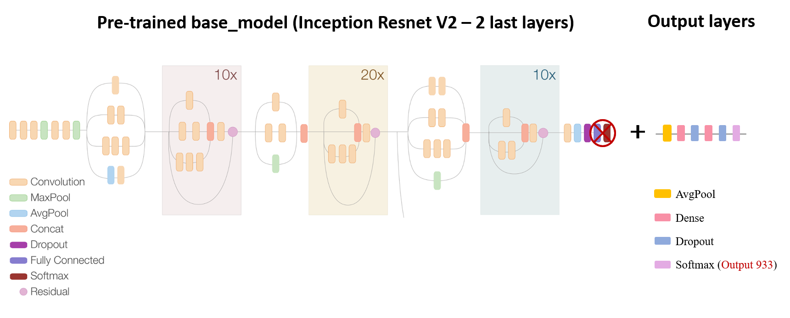
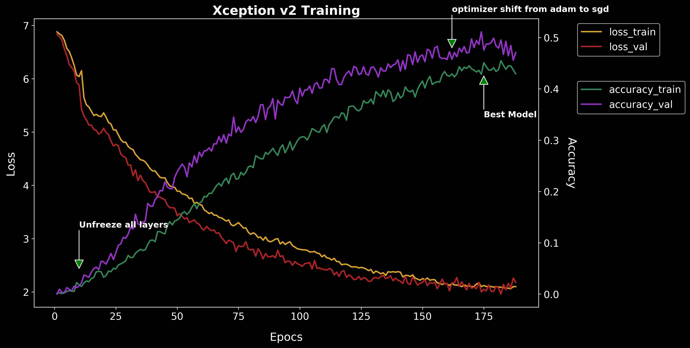
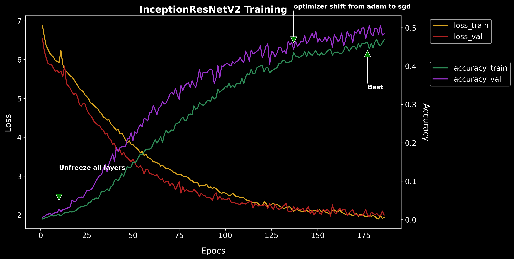
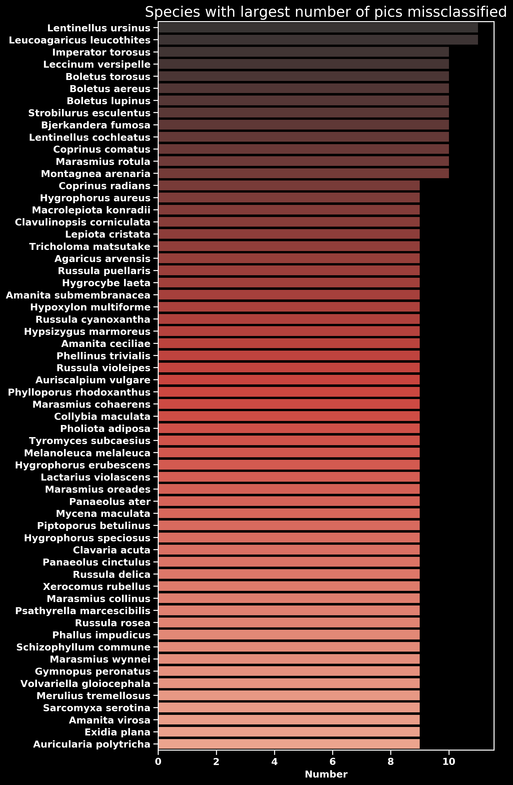
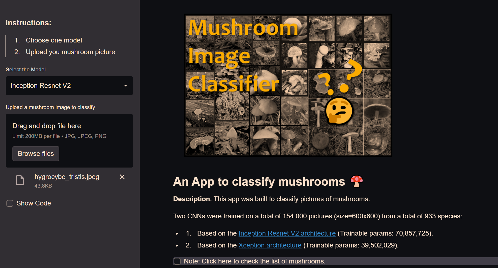
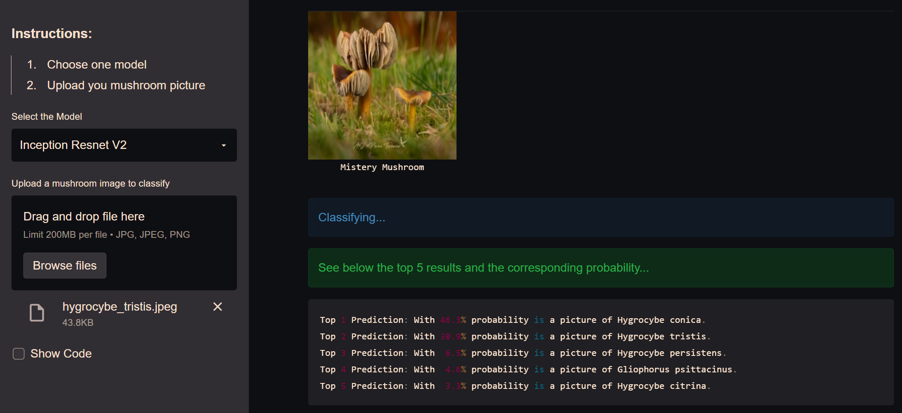

# Mushroom Recognition Classifier using CNNs

### Goal:
The aim of this project is to create a tool able to classify pictures of mushrooms from around 1000 different popular mushroom species.

## Introduction:

Mushrooms represent an important food source and they are used extensively in cooking, in many cuisines (notably Chinese, Korean, European, and Japanese). Furthermore, many people enjoy mushroom collection as a outdoor activity. However, this activity, entails some health risk, since some species that are poisoness look similar to edible specimens. In the example below I present such case of similarity between a delicious and edible mushroom *Macrolepiota mastoidea* and a *Amanita phaloides* which ingestion can lead to death.

Hence, it is important to discern what mushrooms are safe to pick.

In this notebook, I will train an algorithm that can aid us in classifying mushroom species.

 

## Code and Resources Used:

**Python Version**: 3.7

**Packages used**: pandas, numpy, csv, bing_image_downloader, simple_image_download, pathlib, sys, re, datetime, os, time, glob, shutil, sklearn, matplotlib, seaborn, splitfolders, keras (2.4.0) and tensorflow (2.3.1).

---

## 1. Scrape mushroom information and generate the picture dataset

   * **1.1** Get all the scientific names: I obtained a total of 2000 mushroom species. Next I removed the "var." species and some duplicates. This yielded a total of **1911 total mushrooms.**

> From these species I selected the most popular ones.

> For this I defined a function ``finder`` to scrape the hits from a google search with "Word1 Word2" in quotations to get an idea of the popularity of each specie.

> A second function ``parse_value_syntax`` was used to parse the value into a float.

> Using the hits in google I filtered those species with more than **20.000 hits** resulting in a total of **1071 mushroom species**.

   * **1.2** Use the scientific names to scrape pictures.
   
> Google pictures were scraped using the ``simple_image_download`` library.

> Bing pictures were scraped using the ``bing_image_downloader`` library..

---
   
## 2. Prepare the picture dataset

   * **2.1 Removed duplicate pictures** using the free available software [Fast Duplicate File Finder](https://www.mindgems.com/products/Fast-Duplicate-File-Finder/Fast-Duplicate-File-Finder-About.htm).
   
   * **2.2 Renaming** folders (replace " ", by "_")

   * **2.3 Re-size** all the pictures from the picture dataset to **600x600 pixels** 

   * **2.4 Convert all pictures into the same format** (i.e. jpeg)

   * **2.5 Organize train, test, and validation** image datasets into a consistent directory structure (**Ratio: 0.75/0.15/0.15**).

    ├── test
    │   ├── mushroom_name
    │   │   └── name_01.jpeg
    │   └── ...
    │       └── name_n.jpeg
    ├── train
    │   ├── mushroom_name
    │   │   └── name_01.jpeg
    │   └── ...
    │       └── name_n.jpeg
    └── validation
        ├── mushroom_name
        │   └── name_01.jpeg
        └── ...
            └── name_n.jpeg
            
	    
	    
* **2.6 Final picture dataset** contained a total of **154.000 pictures** (11GB) distributed among **933 mushroom species** as follow:
	
	  
	 
---
            
## 3. Select CNN models for transfer learning

I selected Xception and  inception resnet v2 for transfer learning, models with reduced complexity which give good results on the **ImageNet** dataset. See this [paper](https://arxiv.org/abs/1810.00736) for model performance comparission. 

  
 
  Xception Architecture used:
  
  
 
   Inception Resnet V2 Architecture used:
  
  
 
 
---
            
## 4. Create ImageDataGenerators and train the CNN model(s).

  * **4.1 Data Augmentation**: To expand the training dataset in order to improve the performance and ability of the model to generalize.
  
  See below an example on how data augmentation generates different variants of the same picture.
  
   

* **4.2 Xception(2016) Model Training - Trainable params: 27,946,080. Picture size=299x299 (Trained on pictures of 823 mushroom species total)**

 

We observe a better performance on the validation set compared to the training set. A possible explanation is that the validation set may be easier than the training set. [See this article](https://www.pyimagesearch.com/2019/10/14/why-is-my-validation-loss-lower-than-my-training-loss/). After inspecting the picture set obtained from google images, I observed pictures duplicated in both sets. Hence, some data cleaning by removing duplicate pictures may help by making the model to generalize better.

* **4.3 Xception Performance Evaluation**

Xception model -> accuracy: 70.30%, loss: 1.02

Example Single Picture Evaluation:

  

    * Top 1 Prediction: With 48.6% probability is a picture of Amanita muscaria. ✔
    * Top 2 Prediction: With 18.7% probability is a picture of Amanita hongoi.
    * Top 3 Prediction: With 18.1% probability is a picture of Amanita heterochroma.
    * Top 4 Prediction: With  6.5% probability is a picture of Amanita parcivolvata.
    * Top 5 Prediction: With  4.9% probability is a picture of Amanita xanthocephala.

 

    * Top 1 Prediction: With 89.2% probability is a picture of Lactarius deliciosus. ✔
    * Top 2 Prediction: With  5.6% probability is a picture of Lactarius salmonicolor.
    * Top 3 Prediction: With  2.6% probability is a picture of Lactarius semisanguifluus.
    * Top 4 Prediction: With  1.5% probability is a picture of Lactarius.
    * Top 5 Prediction: With  1.0% probability is a picture of Lactarius sanguifluus.

Next, I increased the number of mushroom species adn I trained the Xception model again using a **larger picture size (600x600)**. 

*Note 1: After adding more mushroom species the accuracy of the model is expected to decrease, in particular, due to the large amount of species within the same mushroom Genus such Agaricus (16 species), Amanita (36 species), Boletus (23), Lactarius (38), Russula (40) and Cortinarius (48) since mushrooms with the same genus share many morphological features*

*Note 2: I tried training EfficientNetB7(2020) but it took too long to train.*

* **4.4 Model Training. Xception model version 2 (Trainable params: 39,502,029) and Inception Resnet V2 (Trainable params: 70,857,725). Picture_size=600x600 (Trained on pictures of 933 mushroom species total)**

The hyperparameter batch_size is important as it largely affects the generalization and convergence speed of the model. Large batch sizes may cause bad generalization, but will converge faster ([See this blog for more info](https://towardsdatascience.com/how-to-break-gpu-memory-boundaries-even-with-large-batch-sizes-7a9c27a400ce)). Here, a batch_size of 12 was chosen, partly due to GPU memory limitations.

Regarding the optimizer, I employed Adam first and switched to sgd at the end of the training try squeezing the last bit of accuracy. [Read more this blog](https://mlfromscratch.com/optimizers-explained/#/) to understand better how to pick the right optimizer. 

**Training**:

 

 

* **4.5 Model Performance Evaluation**

Final Xception model -> 
> * **accuracy: 48.1%, loss:  2.07** 
> * **accuracy top 5: 79%** (probability that the correct mushroom is among the top 5 results)

Final Inception ResNet V2 model
> * **accuracy: 49.3%, loss:  2.01**
> * **accuracy top 5: 81%** (probability that the correct mushroom is among the top 5 results)

Inception Resnet V2 model performs only performs slightly better than xception despite having 70% more parameters.

* **4.6 Xception Evaluation of single pictures**

  

	* Top 1 Prediction: With 71.8% probability is a picture of Galerina clavata. ✔
	* Top 2 Prediction: With  8.2% probability is a picture of Hygrocybe laeta.
	* Top 3 Prediction: With  3.9% probability is a picture of Entoloma incanum.
	* Top 4 Prediction: With  3.1% probability is a picture of Rickenella  fibula.
	* Top 5 Prediction: With  2.6% probability is a picture of Hygrocybe psittacina.
	
 

	* Top 1 Prediction: With 37.3% probability is a picture of Hygrocybe coccinea. ✔
	* Top 2 Prediction: With 22.3% probability is a picture of Hygrocybe punicea.
	* Top 3 Prediction: With  9.2% probability is a picture of Hygrocybe miniata.
	* Top 4 Prediction: With  5.4% probability is a picture of Hygrocybe laeta.
	* Top 5 Prediction: With  4.1% probability is a picture of Hygrocybe conica.

 

	* Top 1 Prediction: With 25.9% probability is a picture of Coprinopsis cinerea. ✔
	* Top 2 Prediction: With 22.1% probability is a picture of Coprinus lagopus.
	* Top 3 Prediction: With 11.1% probability is a picture of Coprinus niveus.
	* Top 4 Prediction: With 10.8% probability is a picture of Coprinopsis ephemeroides.
	* Top 5 Prediction: With  6.8% probability is a picture of Coprinopsis radiata.
    
Next I checked what mushrooms are missclassified: 

This information can be critical for the use case of this algorithm, since we want to make sure that poisonous species are not misclassified as edible ones. 

* **4.7 Ideas for improving the model performance**:

	* To reduce the missclassification of poisonous species it would be recommended to increase the amount of pictures for those species.

	* Another option to improve model accuracy for poisonous mushrooms would be to penalize false negatives for those particular species by increasing the weight for those classes. For this we can use [tf.nn.weighted_cross_entropy_with_logits](https://www.tensorflow.org/api_docs/python/tf/nn/weighted_cross_entropy_with_logits).

		>  * ``pos_weight`` > 1 will **decrease the false negative count**, hence increasing the **recall**. (This is what we want for poisonous species).
		>  * Conversely setting ``pos_weight`` < 1 **decreases the false positive count** and increases the **precision**.
		
	* Finally, due to the fasting evolving nature of the computer vision field, it is always recommended to follow the lastest trends: For instance, just recently (March-April 2021) two papers have been published reporting **substantial improvements** of **[Resnets](https://arxiv.org/pdf/2103.07579.pdf)** and **[EfficientNetV2](https://arxiv.org/pdf/2104.00298.pdf)**, in both, **training speed and performance** in the ImageNet dataset.
	
---

## 5 Productionalize the Model with streamlit and heroku

I built locally an app with the [Streamlit](https://streamlit.io/) package and deployed it using the [Heroku](https://dashboard.heroku.com/apps) framework.

See below couple of screenshots of the app:

 

