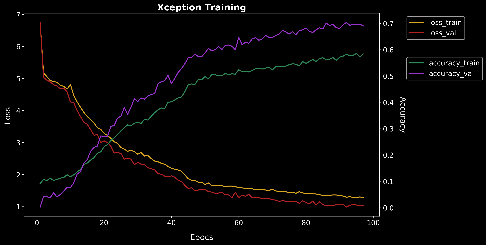

# Mushroom classifier (CNN)

The goal in this project is to train a CNN to classify pictures of mushrooms from around 1000 different species.

## Introduction:

Mushrooms represent an important food source and they are used extensively in cooking, in many cuisines (notably Chinese, Korean, European, and Japanese). Furthermore, many people enjoy mushroom collection as a outdoor activity. However, this activity, entails some health risk, since some species that are poisoness look similar to edible specimens. In the example below I present such case of similarity between a delicious and edible mushroom *Macrolepiota mastoidea* and a *Amanita phaloides* which ingestion can lead to death.

Hence, it is important to discern what mushrooms are safe to pick.

In this notebook, I will train an algorithm that can aid us in classifying mushroom species.

 

## Code and Resources Used:

**Python Version**: 3.7

**Packages used**: pandas, numpy, csv, bing_image_downloader, simple_image_download, pathlib, sys, re, datetime, os, time, glob, shutil, sklearn, matplotlib, seaborn, splitfolders, keras (2.3.1) and tensorflow (2.4.0).

## 1. Scrape mushroom information and generate the picture dataset

   * **1.1** Get all the scientific names: I obtained a total of 2000 mushroom species. Next I removed the "var." species and some duplicates. This yielded a total of **1911 total mushrooms.**

> From these species I selected the most popular ones.

> For this I defined a function ``finder`` to scrape the hits from a google search with "Word1 Word2" in quotations to get an idea of the popularity of each specie.

> A second function ``parse_value_syntax`` was used to parse the value into a float.

> Using the hits in google I filtered those species with more than **20.000 hits** resulting in a total of **1071 mushroom species**.

   * **1.2** Use the scientific names to scrape pictures.
   
> Google pictures were scraped using the ``simple_image_download`` library.

> Bing pictures were scraped using the ``bing_image_downloader`` library..
   
## 2. Prepare the picture dataset

   * **2.1 Removed duplicate pictures** using the free available software [Fast Duplicate File Finder](https://www.mindgems.com/products/Fast-Duplicate-File-Finder/Fast-Duplicate-File-Finder-About.htm).
   
   * **2.2 Renaming** folders (replace " ", by "_")

   * **2.3 Re-size** all the pictures from the picture dataset to **600x600 pixels** 

   * **2.4 Convert all pictures into the same format** (i.e. jpeg)

   * **2.5 Organize train, test, and validation** image datasets into a consistent directory structure (**Ratio: 0.75/0.15/0.15**).

    ├── test
    │   ├── mushroom_name
    │   │   └── name_01.jpeg
    │   └── ...
    │       └── name_n.jpeg
    ├── train
    │   ├── mushroom_name
    │   │   └── name_01.jpeg
    │   └── ...
    │       └── name_n.jpeg
    └── validation
        ├── mushroom_name
        │   └── name_01.jpeg
        └── ...
            └── name_n.jpeg
            
	    
	    
* **2.6 Final picture dataset** contained a total of **154.000 pictures** (11GB) distributed among **933 mushroom species** as follow:
	
	  
            
## 3. Select CNN models for transfer learning

Three different models reported to have high accuracy on the **ImageNet** dataset were selected for transfer learning. See this [paper](https://arxiv.org/abs/1810.00736) for model performance comparission. 

  
            
## 4. Create ImageDataGenerators and train the CNN model(s).

  * **4.1 Data Augmentation**: To expand the training dataset in order to improve the performance and ability of the model to generalize.
  
  See below an example on how data augmentation generates different variants of the same picture.
  
   

* **4.2 Xception(2016) Model Training - Trainable params: 27,946,080. Picture size=299x299**

 

We observe a better performance on the validation set compared to the training set. A possible explanation is that the validation set may be easier than the training set. [See this article](https://www.pyimagesearch.com/2019/10/14/why-is-my-validation-loss-lower-than-my-training-loss/). After inspecting the picture set obtained from google images, I observed pictures duplicated in both sets. Hence, some data cleaning by removing duplicate pictures may help by making the model to generalize better.

* **4.3 Xception Performance Evaluation**

Xception model -> accuracy: 70.30%, loss: 1.02

Example Single Picture Evaluation:

  

    * Top 1 Prediction: With 48.6% probability is a picture of Amanita muscaria.
    * Top 2 Prediction: With 18.7% probability is a picture of Amanita hongoi.
    * Top 3 Prediction: With 18.1% probability is a picture of Amanita heterochroma.
    * Top 4 Prediction: With  6.5% probability is a picture of Amanita parcivolvata.
    * Top 5 Prediction: With  4.9% probability is a picture of Amanita xanthocephala.

 

    * Top 1 Prediction: With 89.2% probability is a picture of Lactarius deliciosus.
    * Top 2 Prediction: With  5.6% probability is a picture of Lactarius salmonicolor.
    * Top 3 Prediction: With  2.6% probability is a picture of Lactarius semisanguifluus.
    * Top 4 Prediction: With  1.5% probability is a picture of Lactarius.
    * Top 5 Prediction: With  1.0% probability is a picture of Lactarius sanguifluus.

Next, I will improve the picture dataset, I include more mushroom species and train EfficientNetB7 (2020), a model containing more trainable parameters (Ongoing...▶).

* **4.4 InceptionResNetV2(2016) Model Training - Trainable params: 60,356,494. Picture_size=600x600**

* **4.5 InceptionResNetV2 Performance Evaluation**
